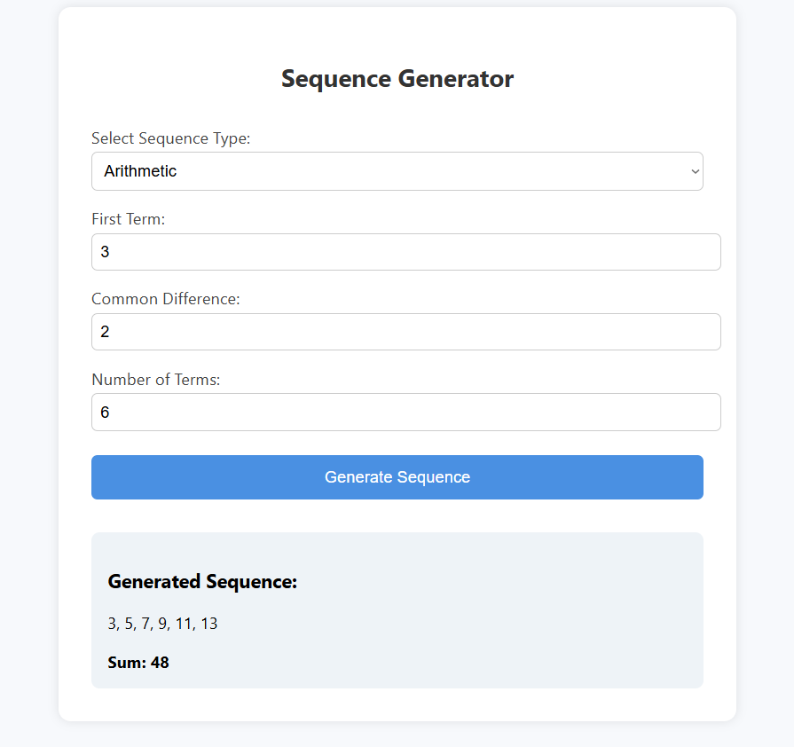

# 🔢 Sequence Generator (React)

A simple React application that generates **Arithmetic** or **Geometric** sequences based on user input. It also calculates the **sum** (for arithmetic) or **product** (for geometric) of the sequence.

---

## ✨ Features

- Choose between Arithmetic or Geometric sequence
- Input:
  - First term
  - Common difference (Arithmetic) or Common ratio (Geometric)
  - Number of terms
- Displays the full sequence
- Displays the sum or product of the sequence
- Basic styled UI with CSS

---

## 📸 Preview

## 

## 🛠 Installation

1. **Clone the repo:**

   ```bash
   git clone https://github.com/itsvee0120/AD315.git
   cd sequence-generator
   ```

2. **Install dependencies:**

   ```bash
   npm install
   ```

3. **Run the app:**

   ```bash
   npm start
   ```
